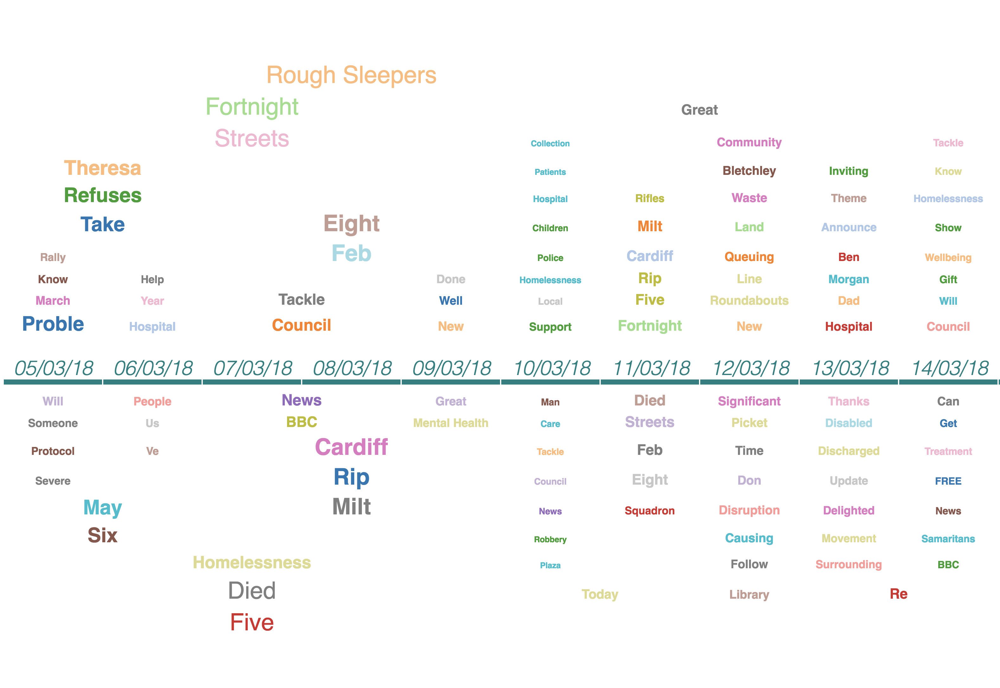
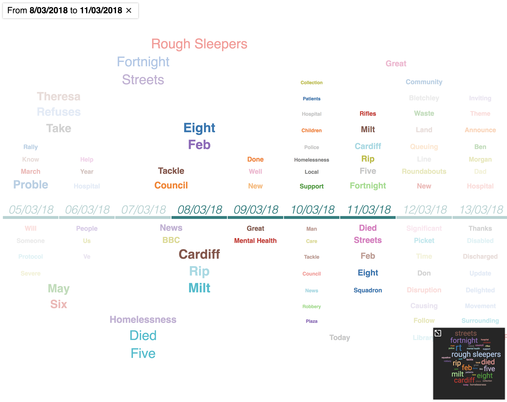
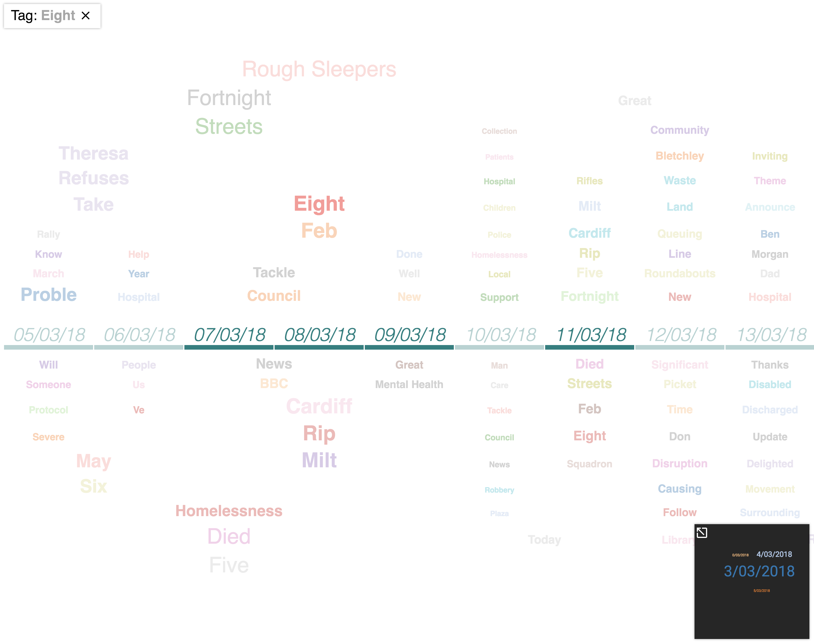

# TemporalCloud

This project extends classic Word Cloud with a dependency to an extra dimension, e.g. time in the implemented example.

## Problem
When you have a set of documents at different time, a classic word cloud does not take in account the word evolution. Up to know there is not an exploration tool which could at the same time enable time sorting and word aggregation.

## Idea
This project is a proof of concept: it is possible to extend the concept of word cloud in case words are related to an extra feature such as time? How the extended word cloud should work and look like? The extend word cloud is more informative and yet usable for end users?

### Concept
A tag cloud built on top of a timeline:

  1) words are closer to the timeline if they are specifically related to the date  
  2) words about a time interval are on top of more specific words
  3) size of words represent the strenght of the word in a given interval

### Interactions
  1) click on dates selects a sub interval
  2) given a subinterval, a classic [word cloud](https://github.com/jasondavies/d3-cloud) is being rendered in a small box (right bottom)
  3) click on a word will show a classic [word cloud](https://github.com/jasondavies/d3-cloud) of the dates of specifically related to the word
  

  
 ## Implementation
The temporal cloud is implemented as a table, build appending and prepending rows to a central date row. The words size is based on a given weight (frequency/relevance of the word), calculated cumulating the weight of the word for an continuous interval.

The position of words is based on a greedy approach: from the smallest to the largest date intervals.
 
 ### Future idea
 
 - Improve the rendering of temporal cloud using D3 force graph
 - Compression of the cloud using an heuristic to refine the size of words
